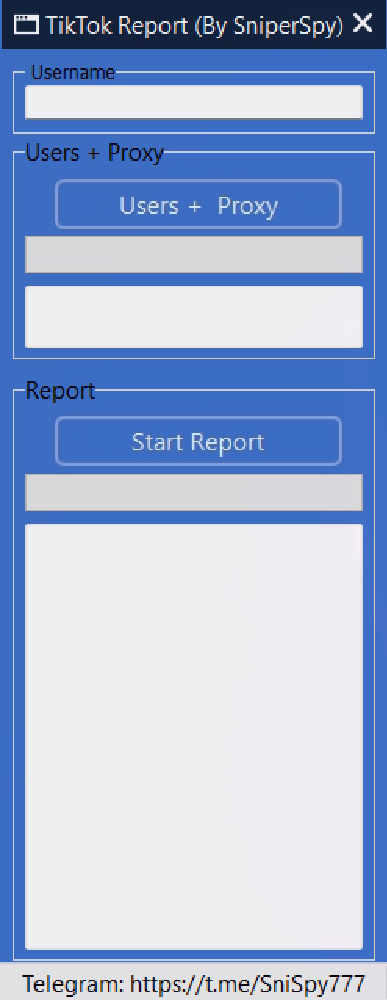

# tiktok-reporting-bot

<h2 align="center">Telegram: https://t.me/tikrepo7</h2>
<h2>What Is a TikTok Reporting Automation Tool? ❓</h2>

A TikTok reporting automation tool is software designed to help users organize and streamline legitimate reports involving profiles, pages, posts, or other content that may violate TikTok Terms, Community Standards, or applicable platform policies.

The system can reduce repetitive manual steps by organizing targets, selecting appropriate reporting categories, validating submitted information, and assisting with the reporting workflow where automation is permitted.

<h2>How Does the System Work? ❓</h2>

The alternative workflow can be organized into several automated stages:

• 1. Target Collection — the user provides the URL or identifier of the profile, page, post, or content that requires review.

• 2. Target Verification — the system checks that the supplied target is accessible and that the required information is available.

• 3. Policy Classification — the reporting reason is matched with the most relevant TikTok policy category.

• 4. Data Preparation — the system prepares the information required for the reporting workflow.

• 5. Workflow Execution — permitted repetitive reporting steps are automated or assisted by the software.

• 6. Validation — the system verifies whether the submission process was completed successfully.

• 7. Monitoring — available report information can be organized so the user can track the relevant status or outcome.

<h2>What Is the Algorithm Behind It? ⚙️</h2>

A different approach can use a validation-and-routing workflow:

<pre>
Target Input
     ↓
URL / Profile Validation
     ↓
Content Information Collection
     ↓
Policy Classification
     ↓
Report Data Validation
     ↓
Workflow Routing
     ↓
Permitted Report Submission
     ↓
Submission Verification
     ↓
Result / Status Monitoring
</pre>

This approach focuses on validating information before initiating the reporting workflow. The software assists with organization and repetitive actions, while TikTok remains responsible for reviewing reports and determining whether enforcement action is appropriate.

<h2>What Features Can the Tool Include? 🔎</h2>

Depending on the implementation, the system may include features such as:

• Profile and page URL management 
• Target information validation 
• Policy-category organization 
• Report data preparation 
• Automated workflow management 
• Submission status tracking 
• Report history and logs 
• Duplicate-report detection 
• User notifications 
• Administrative controls and configuration

Reports are evaluated by TikTok own moderation and enforcement systems. The outcome can depend on the reported content, available evidence, applicable policies, and TikTok internal review process.

<h2>How Can I Get the Tool or Learn More? 📩</h2>

• Join our Telegram channel: https://t.me/tikrepo7

• Review the available information and demonstrations.

• Contact us through the Telegram username provided with the relevant service.

⸻⸻⸻⸻⸻⸻⸻⸻⸻⸻⸻⸻⸻⸻
<h2>Legal Notice ⚠️</h2>

This software is intended only for legitimate reporting, moderation, and platform-compliance purposes. Users must provide truthful information and comply with TikTok Terms of Service, Community Standards, and applicable laws.

Users are solely responsible for the reports they submit and for ensuring that their use of the software does not involve harassment, abuse, spam, fraudulent reporting, or manipulation of TikTok reporting systems.

The software does not provide any guarantee regarding the outcome of a report, account restriction, content removal, or other enforcement action.

==============================================
